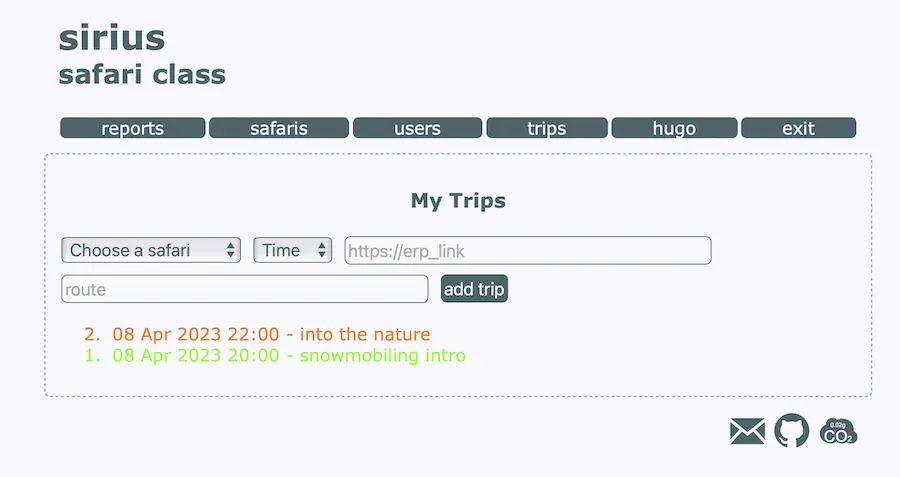

# Sirius

Copyright (c) 2022-2024, astreknet

## Table of Contents

* [Introduction](#introduction)
* [Built with](#built-with)
* [License](#license)
* [Features](#features)
* [Roadmap](#roadmap)
* [Implementation](#implementation)
* [Supporting](#supporting)

## Introduction

Sirius is a minimalistic **safari class** and **accident report** web application aimed to small and medium safari/adventure business.
The idea is to help managers accessing and searching information about safaris, guides, gigs, accidents, near misses in order to get reports and build stadistics to get a better service. Also from the guide point of view helps tracking gigs and encouraging to improve and minimize accidents. 

## Built with

* [OpenBSD 7.5](https://www.openbsd.org)
* [PHP 8.3](https://www.php.net)
* [MariaDB 10.9](https://mariadb.com)
* [HTML5](https://html.spec.whatwg.org)
* [CSS3](https://www.w3.org/TR/CSS/#css)

## License

See [LICENSE](LICENSE).

## Features

### users
Just an **email** is needed to create a user. Invitation to _register_ by _email_. Only the user can **edit his own data**. An _unregistered_ user will be deleted after **one day**. A **validated user** will be automatically logged out after **3 min** of **inactivity**. All the users can send _anonymous feedback_ in their _account page_. 

### userlevels
* **inactive**: _limbo_ status, can not log in.
* **guide**: create and update his own data, issues, trips, close calls and accidents.
* **admin**: same privileges as _guide_. Also can create and modify safaris, upgrade userlevels, download [_vcards_](https://en.wikipedia.org/wiki/VCard) and [CSV](https://en.wikipedia.org/wiki/Comma-separated_values) reports.
* **superadmin**: same privileges as _admin_. Also can create and modify admins.

### safaris
This are the _templates_ of the _trips_. A safari has a **unique name**, a duration and when _active_ is _available_ for the _trips_.

### gigs
An _active user_ can _add_ and _update_ gigs. A gig has a _safari name_, _time_ and a _route_. _Remarks_ can be added later. A gig can have _near misses_ and _accidents_.

### incidents
Work incidents are _near misses_ or _accidents_ (if there is an _injury_), out of a _safari_, during the work time.

### reports
The admins can download gig, near miss, accident, work near miss and work accident reports in CSV format, [spreadsheets](https://en.wikipedia.org/wiki/Spreadsheet) suported by [Apple Numbers](https://en.wikipedia.org/wiki/Numbers_(spreadsheet)), [LibreOffice Calc](https://www.libreoffice.org) or [OpenOffice](https://www.openoffice.org)  among others.

## Roadmap

* [x] automatic darkmode
* [x] responsive
* [x] manage users and userlevels (inactive, guide, admin)
* [x] registration and password recover by mail
* [x] guide contact vcards
* [x] create and activate safari templates
* [x] create and update personal trips
* [x] report accidents and close calls
* [x] work issues: accidents and near misses for the staff
* [x] download CSV reports
    - [x] trips
    - [x] trip near misses
    - [x] trip accidents
    - [x] work near misses
    - [x] work accidents
    - [x] anonymous feedback
* [ ] zones
* [ ] add geolocation button to near misses and accidents 
* [ ] add 'days of the week' to safaris
* [ ] add pictures to the accident report
* [ ] add gear parts and prices (snowmobiles, bikes, skis, etc...)
* [ ] accident report pdf
* [ ] svg icons
  - [x] buttons
  - [ ] menu

## Implementation

* **Local**: built on a server inside your own network. [Installing a server on a spare computer or a Raspberry pi](https://gist.github.com/astreknet/8e177cfb2a0900efa385e6062ae8f7a7) could be a solution but you will have to take care of the links for the new users manually, also everytime a user forgets a password. Plus the access is limitated to the network of the host.   
* **Web Server**: this solution neds a host that complies with the [built with](#built-with) characteristics.
* **Account on [astrek](https://astrek.net)**: ask for a _testing account_ at the contact mail on the [site](https://sirius.astrek.net). 

## Supporting

Sirius is a 100% community-sponsored endeavor. If you want to join our efforts, the easiest thing you can do is support the project financially. Both Monero and Bitcoin donations can be made to **donate.astrek.net** if using a client that supports the [OpenAlias](https://openalias.org) standard.

The Monero donation address is:
`88os6icMF77adsRNucVPvabhinZATE86vHPngidenS1oTtUXQd4tiZk9ZxYKS7iW92cYDpYZs1RdkZrhBieX972MVR7iU9X`

The Bitcoin donation address is:
`bc1q0ph3e2ulwe64v3swjfjcgz3kzucnvduxltaem7`

Also [mail](mailto:donate@astrek.net) for alternative means of donating or if you would like to become a sponsor.
