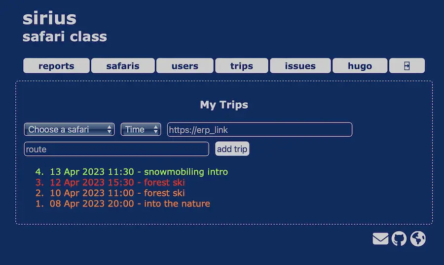

# sirius, safari class
simple, intuitive, _light_ and fast **safari class** and **accident report** web application

  

## built with

* [OpenBSD 7.2](https://www.openbsd.org)
* [PHP 8.1](https://www.php.net)
* [HTML5](https://html.spec.whatwg.org)
* [CSS3](https://www.w3.org/TR/CSS/#css)

## roadmap

* [x] automatic darkmode
* [x] responsive
* [x] manage users and userlevels (inactive, guide, admin)
* [x] download vcards with user contacts
* [x] create and activate safari templates
* [x] create and update personal trips
* [x] report accidents and close calls
* [x] download trips, accidents and close calls reports in csv format
* [ ] add pictures to the accident report
* [ ] add gear parts and prices
* [ ] print accident report pdf
* [ ] multi-language:
  - [x] english
  - [ ] spanish
  - [ ] finnish
